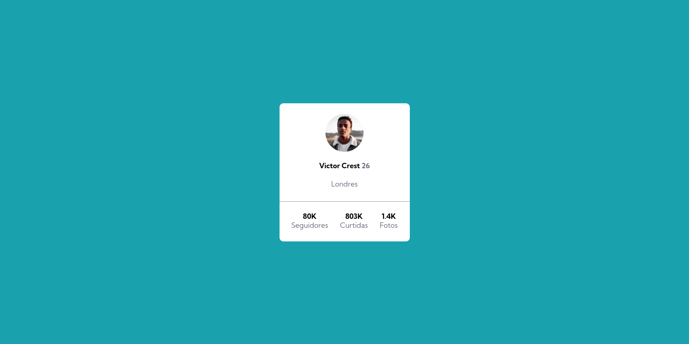
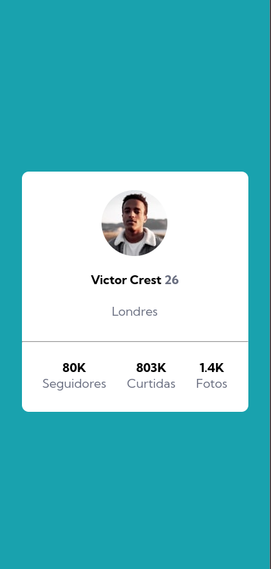

# Frontend Mentor - Profile card component resolução

Esta é a solução do [Profile card component challenge on Frontend Mentor](https://www.frontendmentor.io/challenges/profile-card-component-cfArpWshJ). Os desafios do Frontend Mentor ajudam você a aprimorar suas habilidades de codificação por meio da criação de projetos realistas.

## Categorias

- [Visão geral](#visão-geral)
  - [O desafio](#o-desafio)
  - [Captura de tela](#captura-de-tela)
- [Meu processo](#meu-processo)
  - [Construído com](#construído-com)
  - [O que eu aprendi](#o-que-eu-aprendi)
  - [Áreas para focar](#áreas-para-focar)
- [Autor](#autor)

## Visão geral

### O desafio

- Construir o projeto de acordo com os designs fornecidos

### Captura de tela

Desktop design

Mobile Design
  

    
  

## Meu processo

### Construído com:

- Semântica HTML5 
- Propiedades CSS personalizadas

### O que eu aprendi

- Aprendi a desenvolver alguns quadros do css.      
- Também pude ter uma noção de como funciona na hora de botar a mão na massa e codar.
- Pude compreender melhor como usar classes, divs, variáveis, entre outros códigos.

### Áreas para focar

- Compreender melhor onde encaixar certas tags HTML e CSS
- Buscar conhecimentos sobre codificação

## Autor

- Frontend Mentor - [@Artxoli](https://www.frontendmentor.io/profile/Artxoli)
- Instagram **@Artolix**
